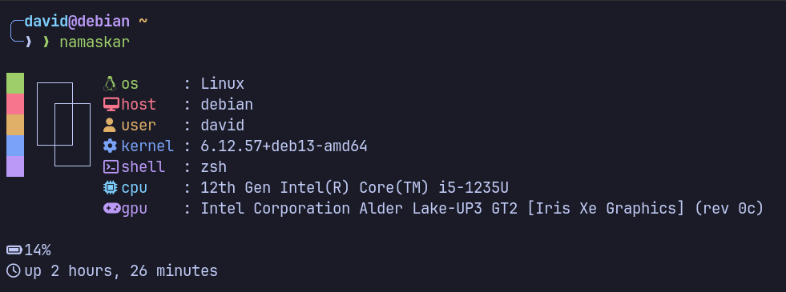

<div align="center">
  
</div>

# Namaskar 🙏
>[!NOTE]
>A minimal alternative to neofetch 

<div align="center">
  
</div>

### Pre-requisites
- Make, Bash and Git should be installed

### Installation
```sh
sudo make install
```

### Uninstallation
```sh
sudo make uninstall
```

### Usage
```sh
namaskar
```
